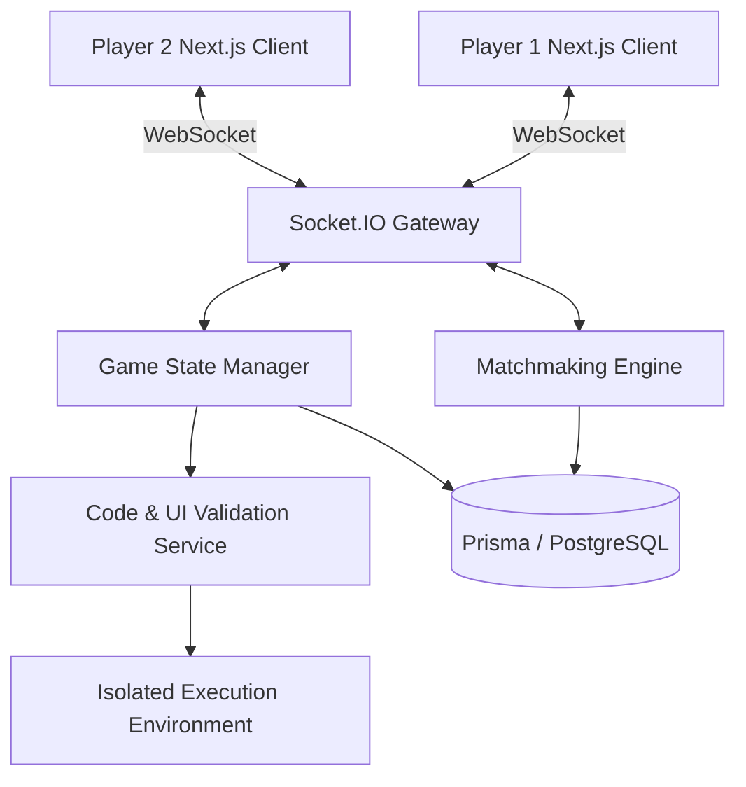

<div align="center">
  
  
  <h1>DebugDuel</h1>
  <p>The Real Time Developer Arena</p>

  <p>
    <a href="https://debugduel.tech"><strong>Play Now on debugduel.tech</strong></a>
  </p>
</div>

<br />

## Overview

DebugDuel is a competitive multiplayer platform designed for software engineers. It places two developers in a real time environment with a broken codebase or a design challenge. The first developer to accurately diagnose, fix, and explain the issue claims victory and climbs the global leaderboard. 

Built with low latency WebSocket communication and a strict Elo ranking system, DebugDuel provides a rigorous environment to test your technical proficiency against peers worldwide.

## Architecture

The platform operates on a decoupled client server architecture, utilizing real time bi directional event streams for gameplay synchronization.



## Core Systems

### Matchmaking Engine
The matchmaking engine places players into a continuous polling pool. Once two players with comparable Elo ratings queue for the same mode, the server allocates a dedicated game room, synchronizes their countdown timers, and simultaneously serves the challenge payload. If an opponent disconnects, an automated forfeit protocol immediately resolves the match.

### Social and Challenge Protocols
Players are issued unique cryptographic friend keys. By sharing these keys, users can populate their friends list, monitor real time active status, and send direct challenge invitations. A strict 30 second cooldown prevents challenge spamming.

## Elo Ranking System

DebugDuel employs a multi tiered Elo rating system to accurately reflect a player's skill across different domains.

1. **DebugDuel Elo:** Measures proficiency in algorithmic debugging and syntax correction.
2. **UI UX Arena Elo:** Tracks performance in pixel perfect CSS recreation and visual design challenges.
3. **Code KBC Elo:** Evaluates rapid fire theoretical knowledge and trivia.

**Overall Elo:** The primary metric displayed on player profiles and leaderboards. It represents the highest rating achieved across all individual modes, ensuring that specialists are rewarded for their depth of expertise.

Winning a match transfers Elo points from the loser to the winner based on the rating disparity between the two players. Defeating a higher ranked opponent yields a larger Elo increase than defeating a lower ranked one.

## Repository Structure

```text
debug-duel/
  ├── frontend/
  │   ├── src/app/          # Next.js App Router views and layouts
  │   ├── src/components/   # Reusable UI components
  │   ├── src/store/        # Zustand state management
  │   └── public/           # Static assets including the SVG logo
  │
  ├── backend/
  │   ├── server.js         # Express and Socket.IO entry point
  │   ├── prisma/           # PostgreSQL schema and migration scripts
  │   └── .env              # Environment configurations
```

## Star History

<a href="https://www.star-history.com/?repos=harshitcodes1308%2Fdebug-duel&type=date&legend=top-left">
 <picture>
   <source media="(prefers-color-scheme: dark)" srcset="https://api.star-history.com/chart?repos=harshitcodes1308/debug-duel&type=date&theme=dark&legend=top-left" />
   <source media="(prefers-color-scheme: light)" srcset="https://api.star-history.com/chart?repos=harshitcodes1308/debug-duel&type=date&legend=top-left" />
   
 </picture>
</a>

## Local Development

To run the platform locally, you will need Node.js and a PostgreSQL instance.

1. **Clone the repository**
   ```bash
   git clone https://github.com/your-org/debug-duel.git
   cd debug-duel
   ```

2. **Configure the Environment**
   Set up your `.env` files in both the `frontend` and `backend` directories with your database credentials and authentication keys.

3. **Initialize the Database**
   ```bash
   cd backend
   npm install
   npx prisma generate
   npx prisma migrate dev
   ```

4. **Start the Backend Server**
   ```bash
   npm run dev
   ```

5. **Start the Frontend Application**
   ```bash
   cd ../frontend
   npm install
   npm run dev
   ```

## Contributing Guidelines

We welcome contributions from the engineering community. To maintain codebase integrity, please adhere to the following workflow:

1. **Fork the repository** and create a feature branch from `main`.
2. **Maintain architectural patterns**: Ensure any new real time features are routed through the existing Socket.IO state manager. Do not implement direct client to database calls.
3. **Commit Messages**: Use clear, imperative commit messages. If your commit does not require a CI CD pipeline trigger, append `[skip ci]` to your commit message to conserve deployment resources.
4. **Pull Requests**: Submit a pull request with a detailed summary of your changes. Ensure your code passes all local linting and type checks before submission.

## License

This project is licensed under standard open source terms. See the LICENSE file for more details.
